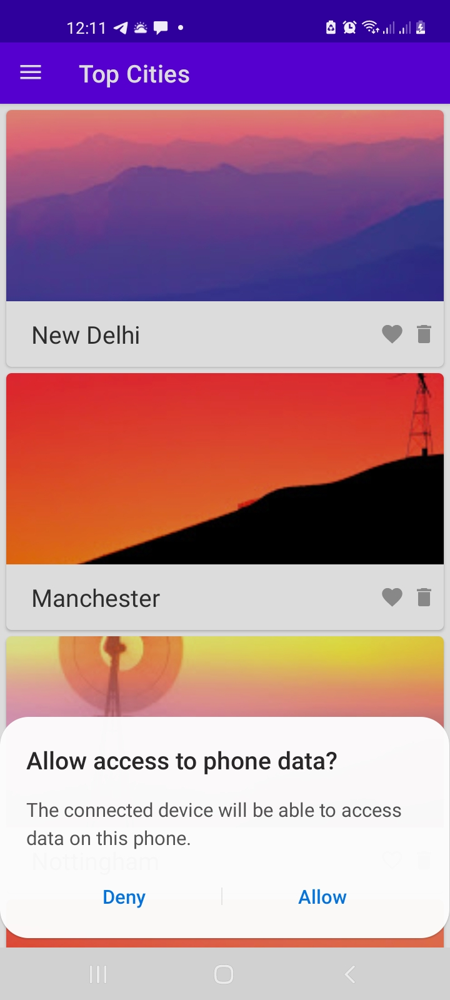
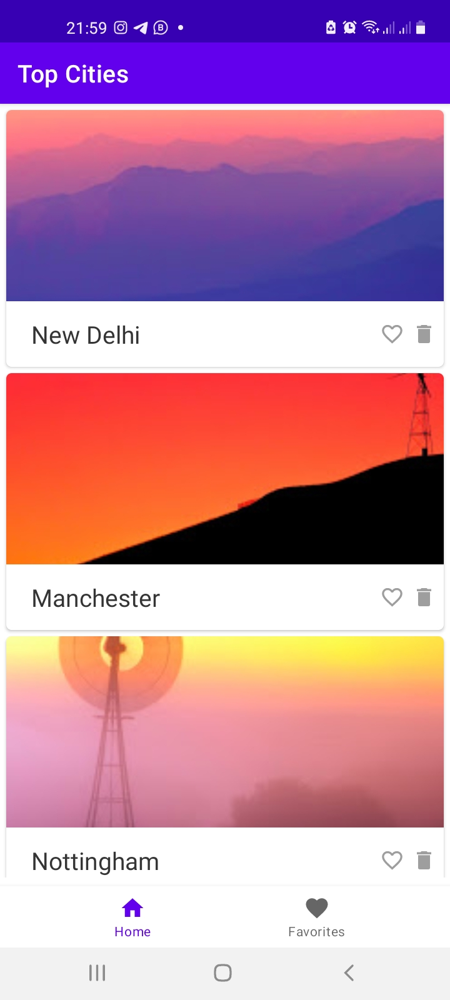
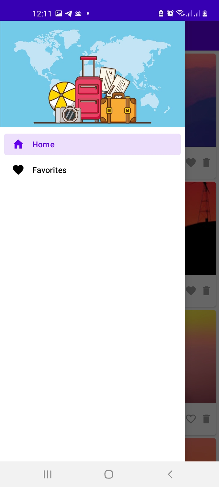
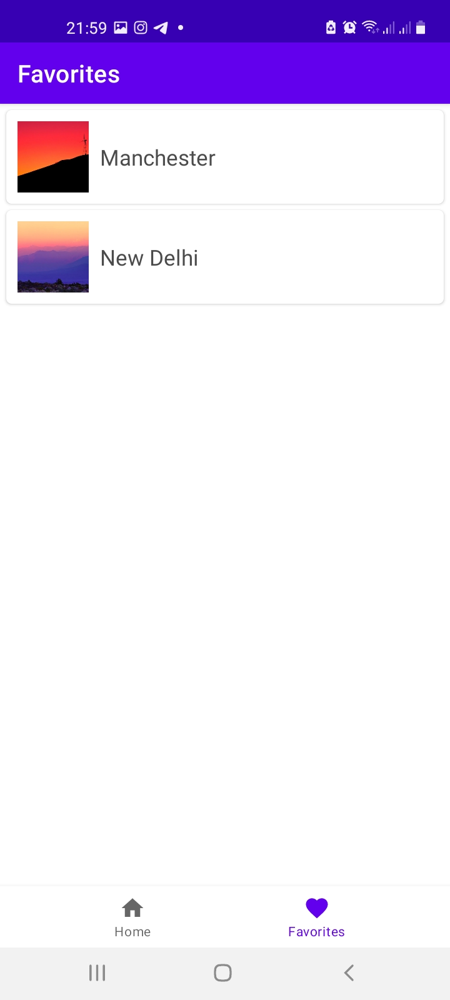

# Travel Destinations

This is an app about travel destinations

---
# preview





---

---
**Version1.0.0**

---

---
## Authors
- Nicholas Barkote <nicholas.kebut@student.moringaschool.com>
---

## Requirements

- Android Studio


# Tech Stack

- Android
- Kotlin
- Navigation

## Setup Instructions

* clone it to your desktop
```bash
 git clone  https://github.com/barkotenicholas/Travel.git
  ```
* Open in in Android studio
## Contact Information

<a href="mailto:barkotenicholas@gmail.com">barkotenicholas@gmail.com</a>


## License & copyright

© Nicholas k Barkote , Moringa school student

Licensed under the [MIT License](LICENSE)

---

